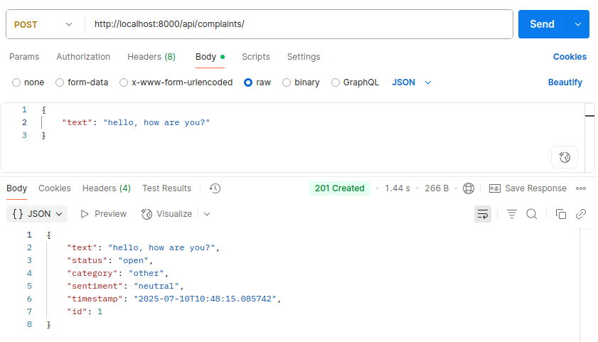
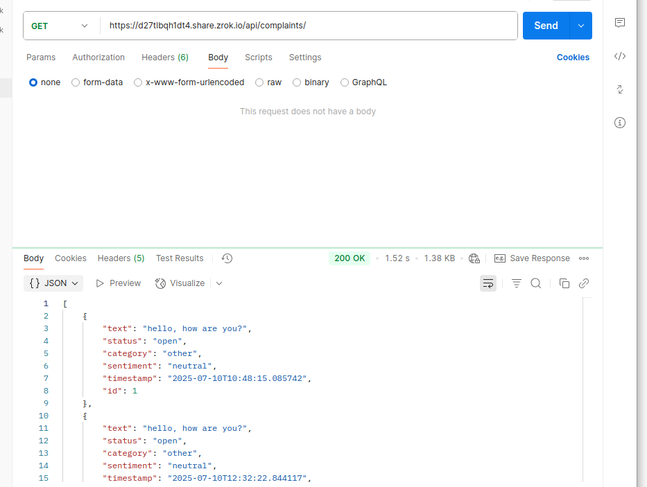
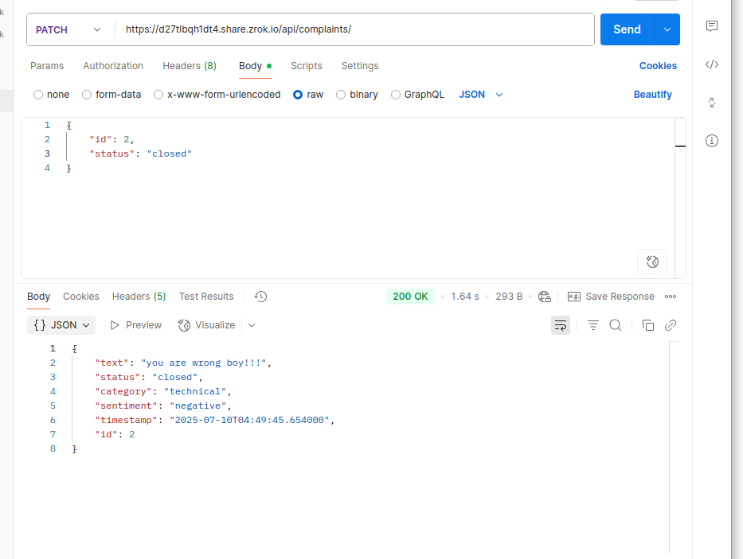
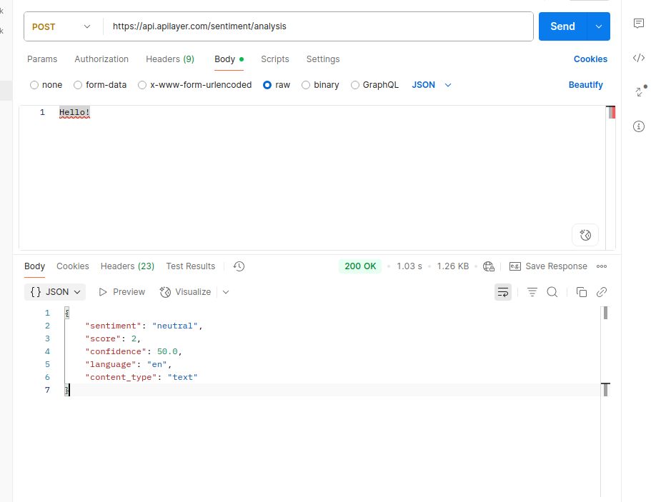
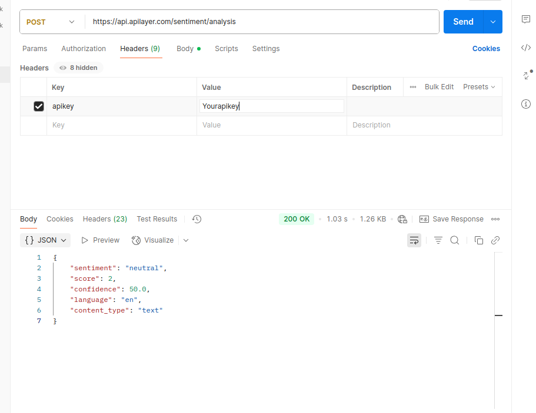

## Customer complaints

The project accepts complaints from the user via API and analyzes them

Functionality:
1. Analyzes the sentiment of a user's message([Sentiment Analysis by APILayer](https://apilayer.com/marketplace/sentiment-analysis-api))
2. Analyzes the message category using [OpenAI API](https://platform.openai.com/docs/guides/completion/overview)

Use the `INSTALL.md` to get started.

### Built With

 
 
 

### Postman Collections

##  post /api/complaints/

##  get /api/complaints/

##  path /api/complaints/

##  [ApiLayer](https://api.apilayer.com/sentiment/analysis)
# post 

# headers 
